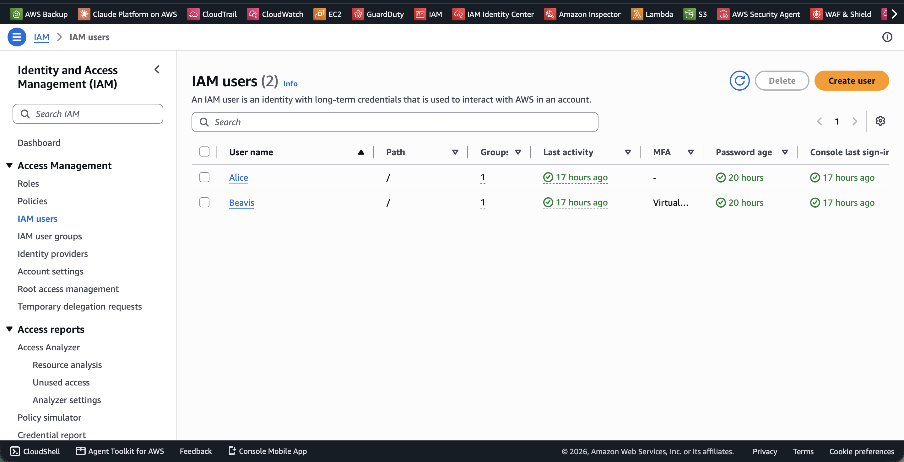
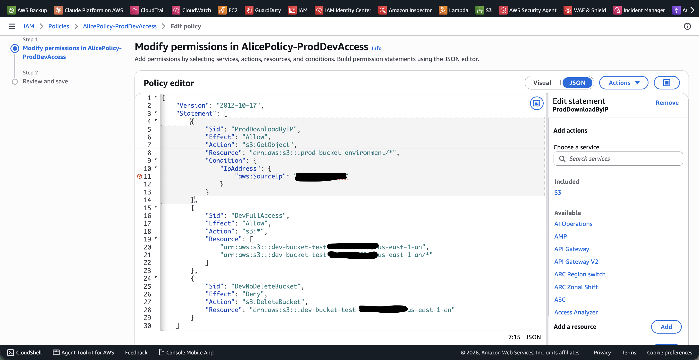
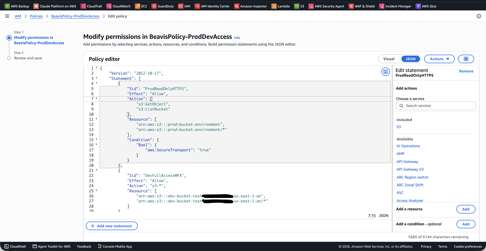
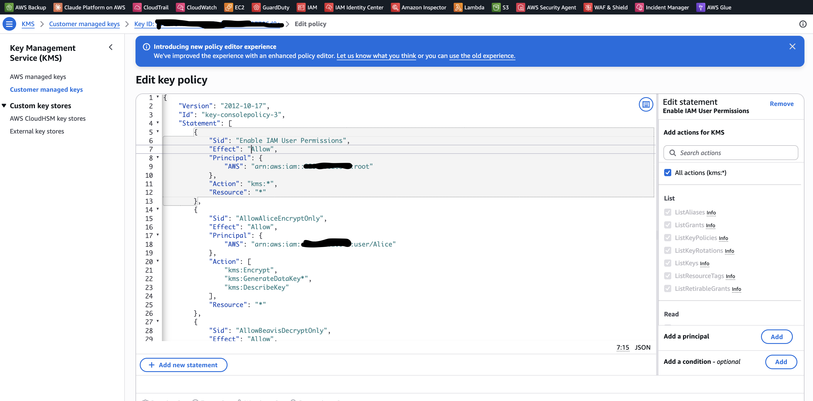
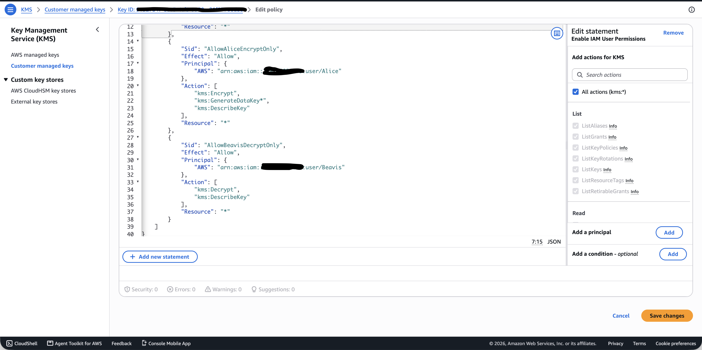
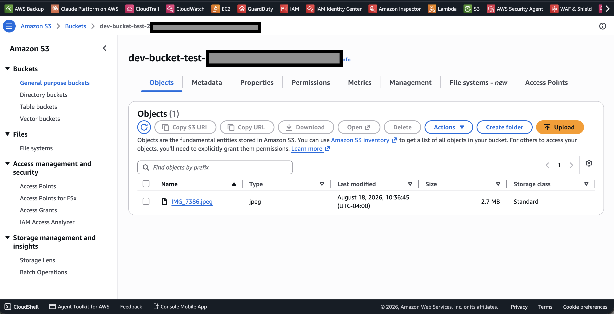

# AWS IAM & KMS Security Architecture

## Project Overview

This project demonstrates the implementation of a segmented AWS
security architecture using IAM, Amazon S3, and AWS KMS.

The environment uses separate IAM identities with distinct permissions
to demonstrate least privilege and separation of duties.

## Objectives

- Implement least-privilege IAM access
- Separate development and production S3 access
- Protect S3 objects with AWS KMS encryption
- Separate encryption and decryption responsibilities
- Restrict sensitive S3 operations
- Enforce secure access controls

## Architecture

### Alice
- Development environment access
- Authorized to encrypt using the customer-managed KMS key
- Restricted S3 operations

### Beavis
- Development environment access
- Read-only production access
- Authorized to decrypt using the customer-managed KMS key

## Security Controls

### IAM Least Privilege

IAM permissions were configured so that each user received only the level of access required for their role. Alice and Beavis were assigned different permissions across development, production, and encryption-related resources rather than receiving broad account-wide access. This reduces unnecessary privileges and limits the impact of a compromised account.

### Separation of Duties

The environment was designed so that encryption and decryption responsibilities were divided between separate identities. Alice was authorized to encrypt data using the customer-managed KMS key, while Beavis was authorized to decrypt it. This separation helps prevent a single user from having unrestricted control over the complete data-protection workflow.

### S3 Access Control

Amazon S3 permissions were scoped by environment and user role. Beavis was granted full access to the development bucket while production access was limited to read-only operations over HTTPS. Resource-level permissions were used to control which buckets and objects each identity could access.

### AWS KMS Encryption

A customer-managed AWS KMS key was used to protect data stored in Amazon S3 with server-side encryption. The key policy granted Alice encryption-related permissions and Beavis decryption-related permissions. When an authorized user retrieved an SSE-KMS protected object, AWS performed the decryption operation after validating both S3 and KMS authorization.

### Network/IP Restrictions

Conditional IAM controls were used to restrict access based on request context, including approved network locations and secure transport requirements. These controls demonstrate how AWS policies can evaluate conditions in addition to identity and resource permissions, reducing exposure from unauthorized network locations.

### Explicit Deny Controls

Explicit deny statements were used to prevent sensitive actions even when another policy might otherwise allow them. In AWS authorization, an explicit deny takes precedence over an allow, making it useful for enforcing non-negotiable security boundaries such as blocking insecure transport or prohibited resource operations.

## Implementation Evidence

### IAM Identities

### Alice IAM Policy

### Beavis IAM Policy

### KMS Encryption and Decryption Permissions

### Encrypted S3 Object

## Testing

The implementation was validated by authenticating as the configured
IAM users and testing their permitted S3 and KMS operations.

## Skills Demonstrated

- AWS IAM
- Amazon S3
- AWS KMS
- Identity and Access Management
- Least Privilege
- Separation of Duties
- Encryption at Rest
- Cloud Security
- Access Control
- IAM Policy Development

## Lessons Learned

This project gave me a much better understanding of how identity, authorization, storage, and encryption controls work together in AWS. Rather than viewing IAM, S3, and KMS as separate services, I learned how permissions across each service must align for a user to successfully perform an action.

One of the most valuable lessons was understanding the difference between S3 access and KMS access. Beavis could have permission to retrieve an object from an S3 bucket, but an object protected with SSE-KMS also required authorization to use the associated KMS key for decryption. I also learned that AWS performs this decryption transparently for an authorized user rather than prompting the user to manually decrypt the file.

Implementing separate permissions for Alice and Beavis reinforced the concepts of least privilege and separation of duties. Alice was given encryption capabilities while Beavis was given decryption capabilities, demonstrating how cloud permissions can be designed around specific responsibilities instead of granting broad access to every user.

Troubleshooting the environment was also an important part of the project. I encountered challenges with MFA authentication and S3 console visibility that required me to review IAM conditions, modify policies, and distinguish between permissions needed to view AWS resources and permissions needed to access those resources. This helped strengthen my understanding of how AWS evaluates identity-based policies, conditional access, and resource permissions.

Overall, this project helped me move beyond simply configuring AWS services and better understand how multiple security controls can be combined to create a layered cloud security architecture.
